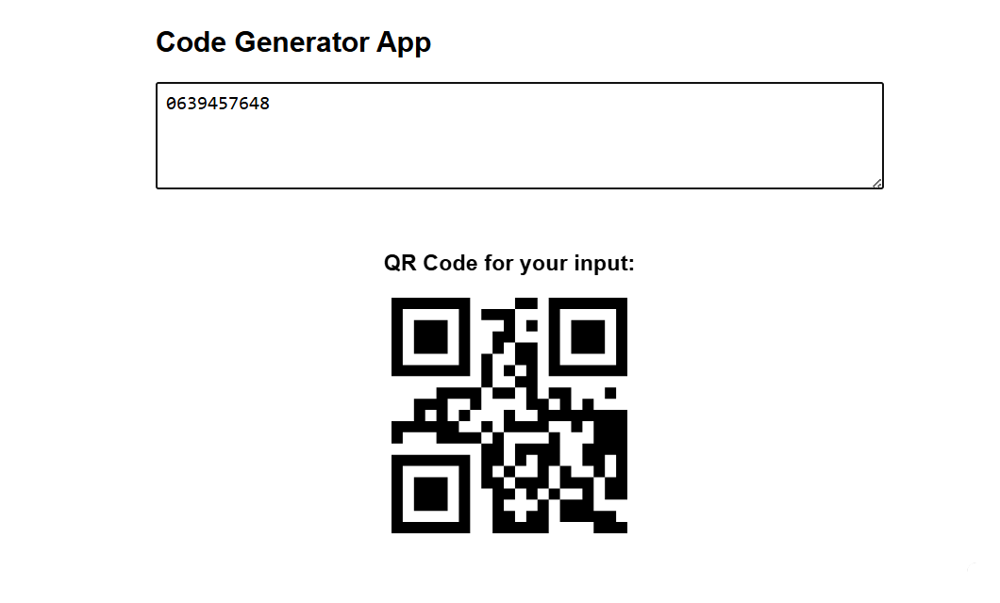

# Code Generator App



A simple React app that generates code snippets and QR codes based on your input.

## Live Demo

Check out the live app here:  
[https://sekomane.github.io/Code-Generator/](https://sekomane.github.io/Code-Generator/)

## Features

- Input description to generate a basic code snippet
- Real-time QR code generation for your input
- Built with React and qrcode.react

## How to Run Locally

1. Clone the repo:

   ```bash
   git clone https://github.com/Sekomane/Code-Generator.git
   cd Code-Generator
